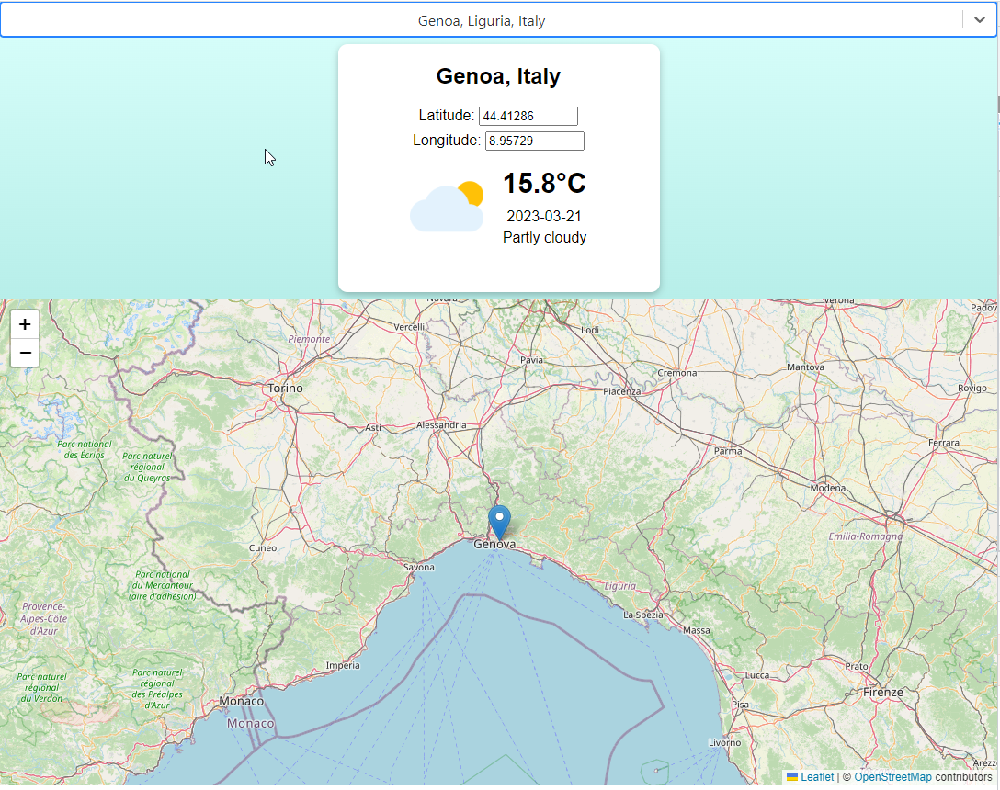

# Weather app

This is a Frontend repository of a pet project for Weather APP.

To test the app go to:

- https://eugenijus-weather-app.netlify.app/

This project was bootstrapped with [Create React App](https://github.com/facebook/create-react-app).

### `npm start`

Runs the app in the development mode.
Open [http://localhost:3000](http://localhost:3000) to view it in your browser.
